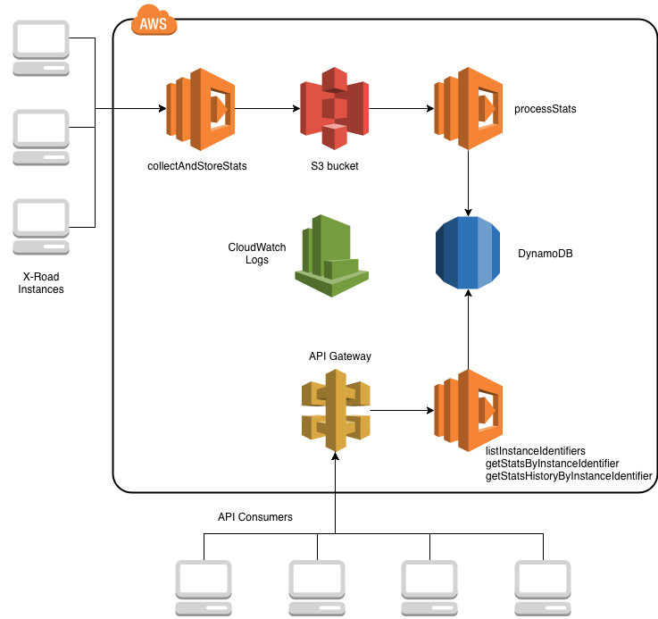

# X-Road Simple Stats Collector

This is a simple statistics collector for the X-Road that reads the number
of members, security servers, subsystems and number of members per member
class from global configuration. The results are returned as a JSON object.

The script implements parts of the [X-Road Protocol for Downloading Configuration](https://github.com/ria-ee/X-Road/blob/develop/doc/Protocols/pr-gconf_x-road_protocol_for_downloading_configuration.md). The script requires the configuration anchor file or global
configuration download URL of the X-Road instance which statistics are processed.
In both cases the script downloads the configuration and reads required information
for calculating the statistics. If configuration anchor is used as an input
the script verifies the key used for signing global configuration and the
signature of the global configuration directory as well. If verifications are
not passed the execution of the script is stopped. The checksum of the downloaded
`shared-params.xml` file is verified too.

Results returned by the script can be printed to the console and/or stored in a
file. The output method is configurable. This is how the results look like:

```
{
    "instanceIdentifier": "DEV",
    "members": 105,
    "subsystems": 293,
    "securityServers": 102,
    "memberClasses": [
        {
            "memberClass": "GOV",
            "memberCount": 29
        },
        {
            "memberClass": "COM",
            "memberCount": 32
        },
        {
            "memberClass": "MUN",
            "memberCount": 42
        },
        {
            "memberClass": "ORG",
            "memberCount": 0
        },
        {
            "memberClass": "EDU",
            "memberCount": 2
        }
    ],
    "date": "2018-12-29"
}
```

## Prerequisites

* git
* npm (tested with v6.0.0)
* Node.js (tested with v9.8.0)

## Try it

Clone the repository:

```
git clone https://github.com/petkivim/x-road-simple-stats-collector.git
```

Install dependencies:

```
cd x-road-simple-stats-collector/
npm install
```

Update configuration (`config.js`). `config.anchorPath` OR `config.url` must be defined.

```
config.anchorPath = '/path/to/configuration_anchor.xml'

config.url = 'http://xxx.xxx.xxx.xxx/internalconf'
```

Run the script:

```
npm start
```

## Configuration

Configuration parameters are defined in the `config.js` file.

| Parameter | Description |
| --- | --- |
| config.anchorPath | Path to locally stored configuration anchor file of the X-Road instance which statistics you want to process, e.g. `/path/to/configuration_anchor.xml`. |
| config.url | URL where global configuration directory of the X-Road instance which statistics you want to process can be downloaded, e.g. `http://xxx.xxx.xxx.xxx/internalconf`. This is the `downloadURL` in configuration anchor. |
| config.sharedParams | Shared parameters configuration part name in the configuration directory. Do not change this. |
| config.verificationCertificateHash | Verification certificate hash label name. Do not change this. |
| config.resultsFile | File where the results are saved. Leave the value empty or comment out the parameter if you don't to save the results in a file. |
| config.randomResultsFile | Use a random UUID as a results file's name (`true` or `false`). If `true`, `config.resultsFile ` is ignored. If `false`, `config.resultsFile` is used. |
| config.resultsToConsole | Print results to console (`true` or `false`). |
| config.s3Bucket | Upload results to S3 instead of storing them locally. |

Parameters `config.anchorPath`, `config.url`, `config.randomResultsFile` and
`s3Bucket` can be set using environment variables `ANCHOR_PATH`, `URL`,
`RANDOM_RESULTS_FILE` and `S3_BUCKET` too. Environment variables have preference
over configuration file.

**N.B.!** Configure only 1) `config.anchorPath` OR 2) `config.url`, but NOT both
at the same time. In case both are configured `config.anchorPath` is used.

## Advanced Version

More advanced version of the script can be deployed on AWS using Serverless
framework. The advanced version collects stats from defined X-Road
instances, stores them in DynamoDB and publishes a REST/json API for accessing
the data.



The advanced version includes four AWS lambda functions:

* `collectAndStoreStats`
  * Fetches global configuration from one or more X-Road instances, extracts
  selected metrics and stores them in `json` file in an S3 bucket.
  * Runs based on defined schedule, e.g. once a day.
  * More than one X-Road instance is added repeating `events` => `schedule` configuration
  under `functions` => `collectAndStoreStats` in `serverless.yml`.
* `processStats`
  * Reads metrics from S3 bucket, stores them in DynamoDB and removes the `json`
  file from S3.
  * Runs every time when a new `.json` file is added in S3.
  * When processing is working as expected, the S3 bucket should be always empty.
* `listInstanceIdentifiers`
  * Implements a REST/JSON API for getting a list of instance identifiers of
  X-Road instances which metrics are available through the API.
  * Is invoked using `HTTP [GET]` request.
  * Reads data from DynamoDB.
* `getStatsByInstanceIdentifier`
  * Implements a REST/JSON API for getting a metrics of a specified X-Road
  instance.
  * Is invoked using `HTTP [GET]` request. X-Road instance is defined using a
  path parameter.
  * Reads data from DynamoDB.

All logs generated by the lambdas are stored in CloudWatch Logs.

### Deploy

`serverless deploy` or `sls deploy`. `sls` is shorthand for the Serverless CLI
command.

**N.B.!** When deploying for the first time, two commands must be issued in the
order below. The second command (`sls s3deploy`) attaches `s3:ObjectCreated`
event to the S3 bucket where collected stats are stored. More
[information](https://www.npmjs.com/package/serverless-plugin-existing-s3) about
`serverless-plugin-existing-s3` Node.js plugin.

```
sls deploy
sls s3deploy
```

If you want to update a function code without changing the CloudFormation stack you can use `deploy function` deployment method. This deployment method does not touch your AWS CloudFormation Stack. Instead, it simply overwrites the zip file of the current function on AWS. This method is much faster, since it does not rely on CloudFormation.

```
serverless deploy function --function collectAndStoreStats
serverless deploy function --function processStats
serverless deploy function --function listInstanceIdentifiers
serverless deploy function --function getStatsByInstanceIdentifier
```

More [information](https://serverless.com/framework/docs/providers/aws/guide/deploying/) about different deployment options.
